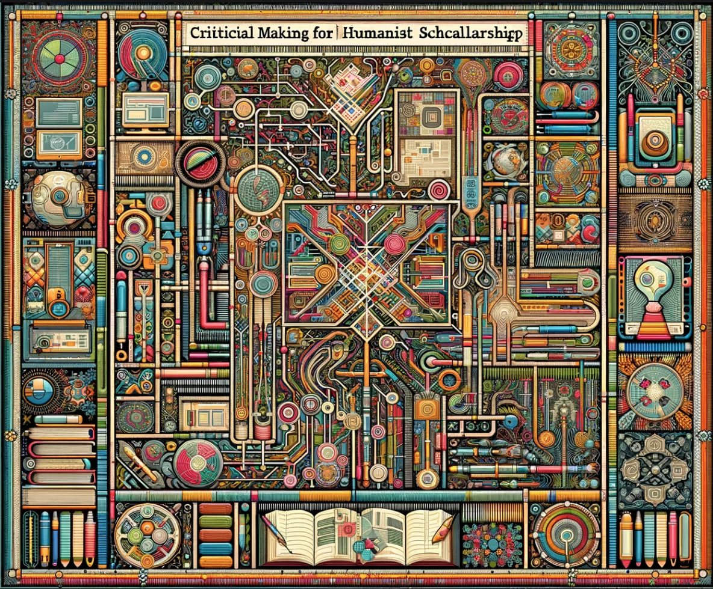

# Sample Syllabus: Graduate Critical Making

- **Instructor:** Dr. Anastasia Salter
  
---

## Contents

- [Sample Syllabus: Graduate Critical Making](#sample-syllabus-graduate-critical-making)
  - [Contents](#contents)
  - [Course Description](#course-description)
  - [Course Objectives](#course-objectives)
  - [Materials and Texts](#materials-and-texts)
  - [Evaluation and Grading](#evaluation-and-grading)
  - [Weekly Schedule](#weekly-schedule)
    - [Week One: Provocations](#week-one-provocations)
    - [Week Two: Selfie](#week-two-selfie)
    - [Week Three: Comic](#week-three-comic)
    - [Week Four: GIF](#week-four-gif)
    - [Week Five: Map](#week-five-map)
    - [Week Six: Hypertext](#week-six-hypertext)
    - [Week Seven: Game](#week-seven-game)
    - [Week Eight: Grammar](#week-eight-grammar)
    - [Week Nine: Analysis](#week-nine-analysis)
    - [Week Ten: Generation](#week-ten-generation)
    - [Week Eleven: Code](#week-eleven-code)
    - [Week Twelve: Narratives](#week-twelve-narratives)
    - [Week Thirteen: GitHub](#week-thirteen-github)
    - [Week Fourteen: Futures](#week-fourteen-futures)
    - [Week Fifteen: Final Reflection](#week-fifteen-final-reflection)

---

## Course Description

Critical making is a practice of making as scholarship, grounded in the humanities, that interweaves design, function, and theory towards born-digital scholarly practice. Engaging in scholarly communication through digital platforms demands attention to code, software, and hardware. This course emphasizes building a theoretical framework and applied practice in critical making, drawing on digital humanities discourse, intentional design, minimal scripting tools, and multimodal development as part of scholarly communication.

The opportunities critical making presents for humanist work are well-documented. Jentery Sayers’ *Making Things and Drawing Boundaries* (which we'll be drawing upon during the course) collects cutting-edge humanist work from across the field, and in doing so points to the important interventions that critical making in the digital humanities can offer in how and what we know about technology as “not made from scratch but in media res; not transparent platforms but patchworks of memory and practice." However, Sayers’ collection is also a reminder of how difficult it is to get started, with participation demanding layered expertise that is constantly changing. The combination of computational and systems thinking required for critical making develops what Michael Mateas describes as procedural literacy: “the ability to read and write processes, to engage procedural representation and aesthetics, to understand the interplay between the culturally‐embedded practices of human meaning‐making and technically‐mediated processes” (Mateas). These skills are of growing interest in transdisciplinary humanities, but still often seen as the domain of STEM programs, and the rhetoric of code and code education remains exclusionary. We will interrogate those assumptions and systems, emphasizing process over product, and building procedural literacy through play and exploration. As we explore computational creativity, we will also engage with the questions emerging from the increased availability and power of generative AI tools.

Each week, plan on following the module for all asynchronous activities. Each module will be divided into three sections:

- **Weekly Readings.** Complete this combination of primary and secondary texts prior to starting the making exercise. The full schedule of required readings is listed in the syllabus, but additional recommended readings will also be provided in each module.
- **Making Exercises.** Each week's making exercise will involve experimenting with a different tool for making: guidance will be provided on configuring and getting started with the tool, and students are encouraged to be inventive and playful.
- **Reflective Discussion.** A weekly online discussion will provide the opportunity to share the process of making: the emphasis is not on "success" or "failure," but on growth, exploration, and experimentation.

---

## Course Objectives

- Explore principles of inclusive design, emphasizing accessible, intersectional, approaches to user-centered making
- Become familiar with open source tools for critical making across born-digital projects, including games, installations, web-driven, critical code studies, and media archaeology approaches
- Develop skills in interface design, working through paper and digital prototyping, and emphasizing both aesthetics and usability
- Identify venues for born-digital scholarship and develop proposals for publication and funding
- Analyze and critique existing born-digital scholarship, learning from methods of scholarly communication in multimodal formats
- Extend existing skills in scripting and web development

---

## Materials and Texts

This course requires a mix of applied and theoretical readings, including some open access materials. The primary texts include:

- Emily Johnson and Anastasia Salter, *Critical Making in the Age of AI.* Forthcoming. [Open Access](forthcoming)
- Sasha Costanza-Chock, *Design Justice.* [Open Access](https://design-justice.pubpub.org/)
- Nick Sousanis, *Unflattening.* 
- Thomas S. Mullaney, Benjamin Peters, Mar Hicks and Kavita Philip. *Your Computer is On Fire.* 

In addition, each module includes samples, tutorials, and resources to guide the week's making. Those materials are linked from the exercise pages included in the weekly schedule below, and are modified directly from *Critical Making in the Age of AI*.

---

## Evaluation and Grading

| Points  | Assignment Summary | Due Date  |
|---|---|---|
| 6  | **Activity Verification** - Complete the brief survey posted on Webcourses as soon as possible to confirm your enrollment in the course. As this is required by the university, please attend to it as soon as possible at the start of classes. | Week One |
| 84  | **Making Exercises** - Weekly discussions will consist of making, sharing, and reflecting on the process of exploring (12 weeks, 7 points each). Students will work from tutorials and try a new form every week, with reflective questions connecting the process of making to the theoretical frameworks and provocations offered by course readings. | Weekly |
| 10 | **Reflection** - During the final exam week, students will complete a written reflective essay on their journey, with particular consideration to next steps and potential future applications of the making mechanisms introduced throughout the semester.  | Final Week |

---

## Weekly Schedule

### Week One: Provocations

- Matt Ratto, "Critical Making: Conceptual and Material Studies in Technology and Social Life." (PDF)
- Jentery Sayers, ["I Don't Know All the Circuitry"](https://dhdebates.gc.cuny.edu/read/untitled-aa1769f2-6c55-485a-81af-ea82cce86966/section/7d8fca82-c6ca-480f-bf17-1df4a2cdb577)
- Bill Endres, ["A Literacy of Building: Making in the Digital Humanities"](https://dhdebates.gc.cuny.edu/read/untitled-aa1769f2-6c55-485a-81af-ea82cce86966/section/2acf33b9-ac0f-4411-8e8f-552bb711e87c#ch04)
- Johnson and Salter, "Provocations for Making"
- **Due: Activity Verification**

### Week Two: Selfie

- *Unflattening* - First Half
- Frank Auerbach, ["Twenty Self-Portraits (Review)"](https://www.theguardian.com/artanddesign/2023/apr/14/frank-auerbach-twenty-self-portraits-review-hazlitt-holland-hibbert-london)
- Piecework Collective, ["Self Portrait"](https://pieceworkcollective.com/2018/)
- Johnson and Salter, "Chapter One: Selfie"
- **[Making Exercise One: "Selfie"](exercises/one_selfie)**

### Week Three: Comic

- *Unflattening* - Second Half
- Garnet Hertz, "Making Critical Making." (PDF)
- Scott McCloud, ["My Obsession with Chess."](https://scottmccloud.com/1-webcomics/chess/chess.html)
- Jason Helms, [*Rhizcomics*](https://www.digitalrhetoriccollaborative.org/rhizcomics/)
- Johnson and Salter, "Chapter Two: Comic"
- **[Making Exercise Two: Comic](exercises/two_comic)**

### Week Four: GIF 

- *Your Computer is On Fire* - Introductions
- David Staley, "On the 'Maker Turn' in Digital Humanities." in [*Making Things and Drawing Boundaries*](https://dhdebates.gc.cuny.edu/projects/making-things-and-drawing-boundaries)
- Explore: [*Buzzademia*](http://hyperrhiz.io/hyperrhiz21/)
- Johnson and Salter, "Chapter Three: GIF" 
- **[Making Exercise Three: GIF](exercises/three_gifs)**

### Week Five: Map 

- *Your Computer is On Fire* - Part I
- Nesbit and Ayers, ["Visualizing Emancipation."](https://dsl.richmond.edu/emancipation/)
- Crider and Anderson, ["Disney Death Tour"](https://kairos.technorhetoric.net/23.2/topoi/crider-anderson/index.html)
- Johnson and Salter, "Chapter Four: Map"
- **[Making Exercise Four: Map](exercises/four_maps)**

### Week Six: Hypertext 

- Laura Okkema, [*Hearing the Voices of the Deserters*](https://stars.library.ucf.edu/etd/6361/)
- Rachel Ponce, [Surviving History: The Fever!](http://theappendix.net/special/the-fever)
- Explore: [*The Digital Review*](https://thedigitalreview.com/)
- Johnson and Salter, "Chapter Five: Hypertext"
- **[Making Exercise Five: Hypertext](exercises/five_hypertext)**
  
### Week Seven: Game 

- *Your Computer is On Fire* - Part II
- Sabinne Harrer, "Radical Jamming." (PDF)
- cecile richard, [*Endless Scroll*](https://haraiva.itch.io/endless-scroll)
- Explore: [The Bitsy Essay Jam](https://itch.io/jam/the-bitsy-essay-jam/entries)
- Johnson and Salter, "Chapter Six: Game"
- **[Making Exercise Six: Game](exercises/six_game)**

### Week Eight: Grammar

- *Your Computer is On Fire* - Part III
- Mark Sample, ["The Infinite Catalog of Crushed Dreams."](https://fugitivetexts.net/pandemicdreams/)
- Leonardo Flores, ["Genre: Bot:](https://iloveepoetry.org/?p=5427)
- Explore: [NaNoGenMo](https://nanogenmo.github.io/)
- Johnson and Salter, "Chapter Seven: Grammar"
- **[Making Exercise Seven: Grammar](exercises/seven_generator)**

### Week Nine: Analysis

- *Your Computer is On Fire* - Afterwords
- *Design Justice* - Introduction
- Catherine D'Ignazio and Lauren Klein, "Feminist Data Visualization." (PDF)
- Micki Kaufman, [*Quantifying Kissinger*](https://blog.quantifyingkissinger.com/)
- Johnson and Salter, "Chapter Eight: Analysis"
- **[Making Exercise Eight: Analysis](exercises/eight_analysis)**

### Week Ten: Generation 

- *Design Justice*: Design Values
- Ian Demsky, ["My Month with Midjourney"](https://electronicbookreview.com/essay/my-month-with-midjourney/)
- Steven Levy, ["Google's NotebookLM Aims to Be the Ultimate Writing Assistant"](https://www.wired.com/story/googles-notebooklm-ai-ultimate-writing-assistant/)
- Explore: [*Kairos Special Issue: Data Visualization*](https://kairos.technorhetoric.net/25.1/index.html)
- Johnson and Salter, "Chapter Nine: Generation"
- **[Making Exercise Nine: Generation](exercises/nine_generation)**

### Week Eleven: Code 

- *Design Justice*: Design Practices
- Kathryn Holland and Susan Brown, "Project \ Process \ Product: Feminist Dica Pgital Subjectivity in a Shifting Scholarly Field" in [*Bodies of Information*](https://dhdebates.gc.cuny.edu/projects/bodies-of-information)
- Salter and Johnson, "Chapter Ten: Crafting Futures in the Age of AI"
- **[Making Exercise Ten: Visualization](exercises/ten_visualization)**

### Week Twelve: Narratives 

- *Design Justice*: Design Narratives
- Debbie Chachra, "Beyond Making" in [*Making Things and Drawing Boundaries*](https://dhdebates.gc.cuny.edu/projects/making-things-and-drawing-boundaries)
- Explore: [Games made with P5.js](https://itch.io/games/made-with-p5js)
- [*Black Beaches*](https://arij.net/investigations/black-beaches-en/)
- **[Making Exercise Eleven: Narrative](exercises/eleven_narrative)**
  
### Week Thirteen: GitHub 

- *Design Justice*: Design Sites
- Natalie Loveless, *How to Make Art at the End of the World* (PDF selection in Canvas)
- Vera Sebert, [*The Book You are Looking For Does Not Exist*](https://the-book-you-are-looking-for-does-not-exist.xyz/)
- Koeser, Doroudian, Budak, Li. "Data Beyond Vision" in [*Startwords* Issue 1](https://startwords.cdh.princeton.edu/)
- **[Making Exercise Twelve: GitHub](exercises/twelve_github)**

### Week Fourteen: Futures 

- *Design Justice*: Design Pedagogies
- Explore: [*Digital Pedagogy in the Humanities*](https://digitalpedagogy.hcommons.org/)
- Quinn Dombrowski, [*Future Text*](https://quinndombrowski.com/textiles/future-text/)
- Joshua Reinier, [*Z^k: A Zettelkablooey*](https://thedigitalreview.com/issue03/zk/index.html)
- **[Optional Making Exercise Thirteen: Multimodal](exercises/thirteen_multimodal)**

### Week Fifteen: Final Reflection 

- Submit & complete your [Final Reflection](exercises/reflection.md), as well as any approved late work, by the end of finals week!
